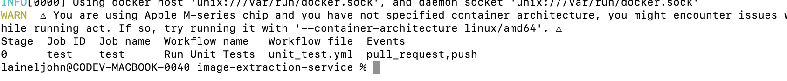

## Testing Workflows

> this method is if you want to avoid having to many commit in your branch workflow it will create a docker container where you can simulate your workflow for free locally before commiting to the remote

> NOTE: for MAC Users only


```
brew install act
```

> find out the available jobs in acts
```
act --list 
```
> you should see something like this 


> once you see there are jobs then you can test and execute that workflow
```
act -j test.yml
```